<div align="center">

# 🚀 DrawOnElon.xyz 🎨

### *The Ultimate Interactive Elon Musk Drawing Experience*


[](https://drawonelon.xyz)
[](https://twitter.com)

---

*Click, Draw, Share, Repeat!* 🔄

**A progressive clicking game where your perseverance unlocks the power to create digital art on Elon Musk's iconic face!**

</div>

## 🎮 Game Mechanics

<table>
<tr>
<td width="50%">

### 👆 **Click Phase**
- Click Elon's face to build up your drawing credits
- Each round requires more clicks:
  - **Round 1:** 10 clicks 
  - **Round 2:** 20 clicks
  - **Round 3:** 40 clicks
  - **Round 4:** 80 clicks
  - And so on... (exponential growth!)

</td>
<td width="50%">

### 🎨 **Draw Phase**
- Unlock 5 precious strokes per session
- Choose from a rainbow of colors
- Adjust brush size (1-20px)
- Create your masterpiece!
- Auto-save progress across rounds

</td>
</tr>
</table>

## ✨ Features

<details>
<summary>🎨 <strong>Advanced Drawing Tools</strong></summary>

- **Color Picker**: HSL hue slider + 24 preset colors
- **Brush Sizes**: Fine control from 1px to 20px
- **Real-time Preview**: See your brush size before drawing
- **Stroke Limiting**: Maximum 5 strokes per drawing session
- **Custom Cursor**: Visual brush size indicator

</details>

<details>
<summary>🎯 <strong>Progressive Gameplay</strong></summary>

- **Exponential Clicking**: Each round doubles the required clicks
- **Session Management**: Track strokes across multiple rounds
- **Round Progression**: Automatic advancement after completing drawing sessions
- **Statistics Tracking**: Monitor total strokes and round progress

</details>

<details>
<summary>💾 <strong>Export & Sharing</strong></summary>

- **PNG Download**: High-quality 500x500px artwork export
- **Twitter Integration**: One-click sharing with pre-filled hashtags
- **Filename Automation**: `elon-masterpiece-round-X-Y-strokes.png`
- **Composite Rendering**: Preserves all drawing layers

</details>

<details>
<summary>🎪 <strong>User Experience</strong></summary>

- **Responsive Design**: Works on desktop, tablet, and mobile
- **Touch Support**: Full touch/stylus compatibility
- **Undo Functionality**: Remove last stroke in current session
- **Clear Canvas**: Reset all drawings instantly
- **Visual Feedback**: Progress bars, status messages, and animations

</details>

## 🛠️ Technology Stack

| Frontend | Styling | State Management | Build Tools |
|----------|---------|------------------|-------------|
|  |  |  |  |
|  |  |  |  |

### 🧩 Key Dependencies

```json
{
  "framework": "Next.js 15.2.4 with App Router",
  "ui_library": "shadcn/ui + Radix UI primitives",
  "styling": "Tailwind CSS with custom animations",
  "fonts": "Geist Sans & Geist Mono",
  "icons": "Lucide React",
  "state": "React useState & useRef hooks",
  "canvas": "HTML5 Canvas API with mouse/touch events"
}
```

## 🚀 Quick Start

### Prerequisites

- **Node.js** 18+ 
- **pnpm** (recommended) or npm/yarn

### Installation

```bash
# Clone the repository
git clone https://github.com/yourusername/DrawOnElon.git
cd DrawOnElon

# Install dependencies
pnpm install

# Start development server
pnpm dev

# Open browser
open http://localhost:3000
```

### Production Build

```bash
# Build for production
pnpm build

# Start production server
pnpm start
```

## 🎯 How to Play

> **Goal:** Create the most amazing Elon Musk artwork by strategically using your limited drawing strokes!

```mermaid
flowchart TD
    A[🖱️ Click Elon's Face] --> B{Reached Click Goal?}
    B -->|No| A
    B -->|Yes| C[🎨 Drawing Mode Activated]
    C --> D[Choose Color & Brush Size]
    D --> E[Draw on Canvas - 5 Strokes Max]
    E --> F{Used All Strokes?}
    F -->|No| E
    F -->|Yes| G[📸 Save Progress]
    G --> H[➡️ Next Round - Double Clicks Required]
    H --> A
```



### 🎮 Game Flow

1. **Click Phase** 👆
   - Click Elon's cartoon face repeatedly
   - Watch your click counter increase
   - Reach the required clicks for your current round

2. **Drawing Phase** 🎨
   - Choose your color from the hue slider or preset palette
   - Adjust brush size with the slider
   - Make 5 strategic strokes on the canvas
   - Use undo if you make a mistake

3. **Export Phase** 📤
   - Download your masterpiece as PNG
   - Share on Twitter with automatic hashtags
   - Progress to next round with doubled click requirement

## 🎨 Drawing Controls

| Control | Description | Range |
|---------|-------------|--------|
| **Hue Slider** | Full color spectrum selection | 0-360° |
| **Color Palette** | 24 preset colors | Basic + Grayscale |
| **Brush Size** | Stroke thickness control | 1-20px |
| **Undo** | Remove last stroke | Current session only |
| **Clear All** | Reset entire canvas | All drawings |

## 📱 Responsive Design

The app adapts beautifully across all devices:

- **🖥️ Desktop**: Full three-panel layout with tools and stats
- **📱 Mobile**: Stacked layout with touch-optimized controls  
- **🎯 Touch Devices**: Native touch/stylus support for drawing

## 🌟 Easter Eggs & Features

<details>
<summary>🎉 <strong>Hidden Features</strong></summary>

- **Custom Cursor**: Brush size preview follows your mouse
- **Progress Persistence**: Your artwork persists across rounds
- **Exponential Scaling**: Click requirements: 10 → 20 → 40 → 80 → 160...
- **Smart Exports**: Filenames include round and stroke count
- **Twitter Ready**: Pre-filled share text with relevant hashtags

</details>

## 🤝 Contributing

We welcome contributions! Here's how to get started:

<details>
<summary>📋 <strong>Development Guidelines</strong></summary>

### Setting Up Development Environment

```bash
# Fork the repository
git clone https://github.com/yourusername/DrawOnElon.git

# Create feature branch
git checkout -b feature/your-feature-name

# Make changes and test
pnpm dev

# Run linter
pnpm lint

# Submit pull request
```

### Contribution Areas

- 🎨 **UI/UX Improvements**: Better animations, responsive design
- 🎮 **Game Mechanics**: New features, difficulty balancing
- 🐛 **Bug Fixes**: Canvas issues, mobile compatibility
- 📱 **Mobile Experience**: Touch improvements, gesture support
- 🌐 **Accessibility**: Screen reader support, keyboard navigation

</details>

## 🗺️ Roadmap

- [ ] 🎵 **Sound Effects**: Click sounds and drawing audio feedback
- [ ] 🏆 **Leaderboards**: Global high scores and artwork galleries
- [ ] 🎭 **Character Selection**: Draw on other famous faces
- [ ] 💾 **Cloud Save**: User accounts and artwork persistence
- [ ] 🎨 **Advanced Tools**: Layers, gradients, and special effects
- [ ] 📱 **PWA Support**: Offline play and app installation
- [ ] 🤖 **AI Integration**: Smart color suggestions and drawing assistance

## 📊 Project Stats

```
📁 Total Files: 71
💻 Lines of Code: ~800
🎨 UI Components: 35+ (shadcn/ui)
🖼️ Drawing Canvas: HTML5 Canvas API
📱 Mobile Optimized: 100%
⚡ Performance Score: 95+
```

## 🎭 Fun Facts

- 🎯 The exponential clicking system means round 10 requires **5,120 clicks**!
- 🎨 Each drawing stroke is stored with color, thickness, and coordinate data
- 📱 The app works with both mouse and touch, including Apple Pencil
- 🚀 Built with the latest Next.js 15 and React 19 features
- 🎪 The custom cursor shows your exact brush size in real-time

## 📄 License

This project is licensed under the **MIT License** - see the [LICENSE](LICENSE) file for details.

---

<div align="center">

### 🌟 Enjoyed DrawOnElon? 

**Star the repo** ⭐ | **Share on Twitter** 🐦 | **Create amazing art** 🎨

*Made with ❤️ and lots of ☕*

**[🚀 Play Now at DrawOnElon.xyz](https://drawonelon.xyz)**

</div>
```
